# 🏗️ Arquitetura e Fluxo de Deploy

## 📊 Visão Geral da Infraestrutura

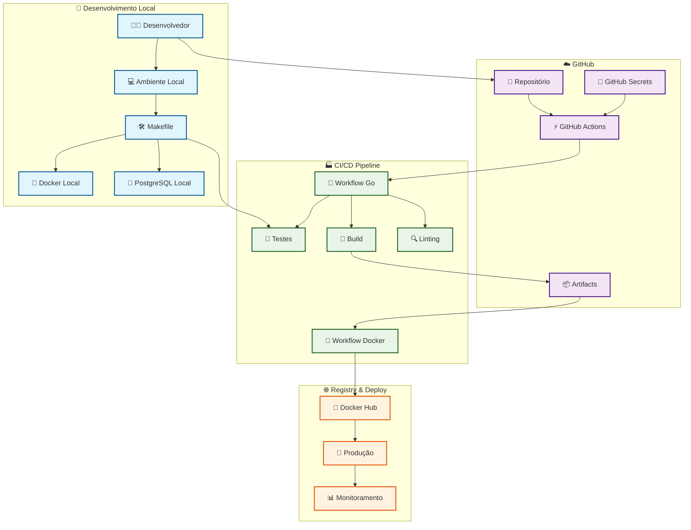

## 🔄 Fluxo Detalhado do Pipeline CI/CD

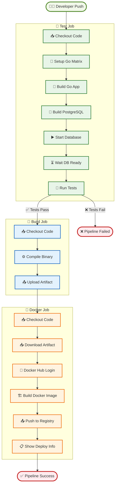

## 🏭 Infraestrutura de Containers

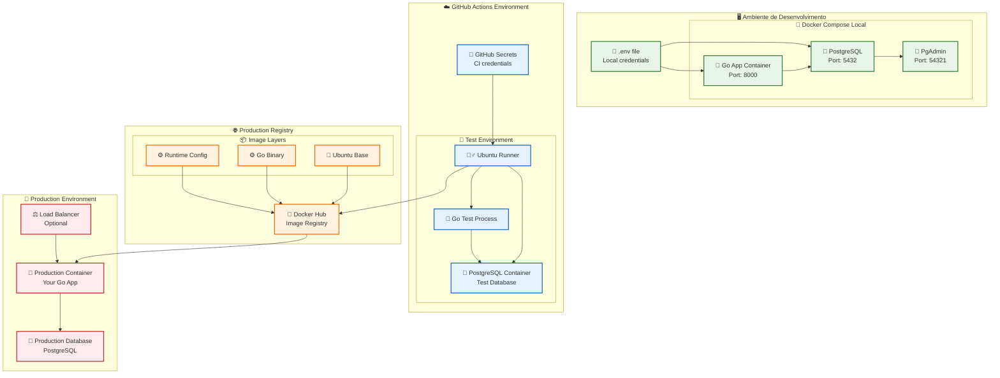

## 🔐 Fluxo de Segurança e Secrets

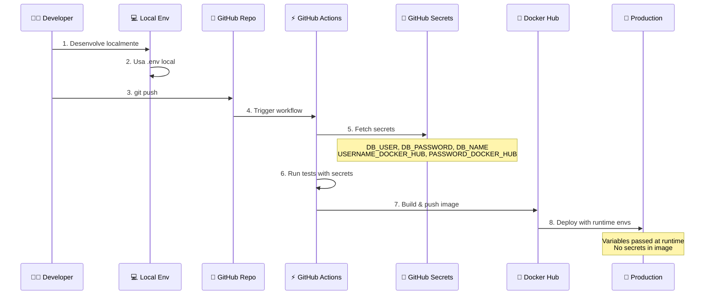

## 📊 Matriz de Ambientes

| Ambiente | Database | Secrets Source | Image Source | Monitoramento |
|----------|----------|----------------|--------------|---------------|
| 🖥️ **Local** | Docker Compose | `.env` file | Local build | Logs locais |
| 🧪 **CI/CD** | GitHub Actions | GitHub Secrets | Temporary build | GitHub Actions logs |
| 🚀 **Production** | External DB | Runtime vars | Docker Hub | APM/Logs externos |

## 🔄 Estratégias de Deploy

### 🚀 AWS Deployment Strategies

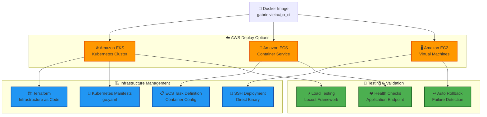

### 📊 Deployment Comparison Matrix

| Strategy | Infrastructure | Scaling | Complexity | Cost | Use Case |
|----------|----------------|---------|------------|------|----------|
| **☸️ EKS** | Kubernetes | Auto-scaling | High | High | Production microservices |
| **🐳 ECS** | Managed containers | Task-based | Medium | Medium | Containerized apps |
| **🖥️ EC2** | Virtual machines | Manual | Low | Low | Simple deployments |

### � Detailed Deploy Flows

#### ☸️ EKS Deployment Flow

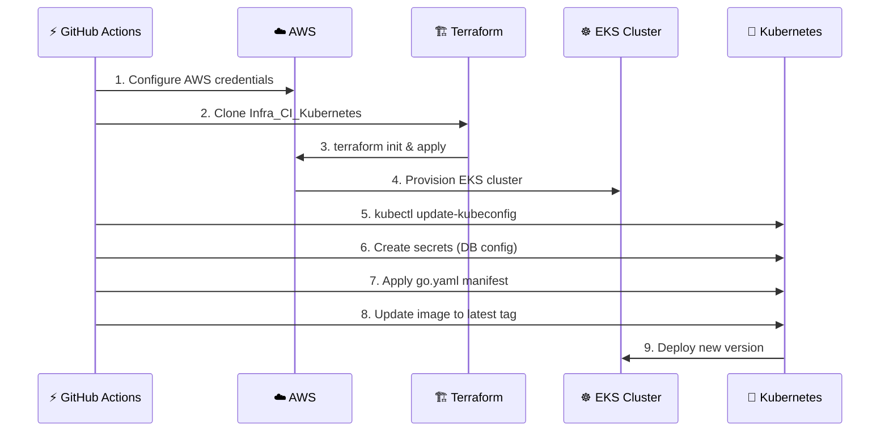

#### 🐳 ECS Deployment Flow

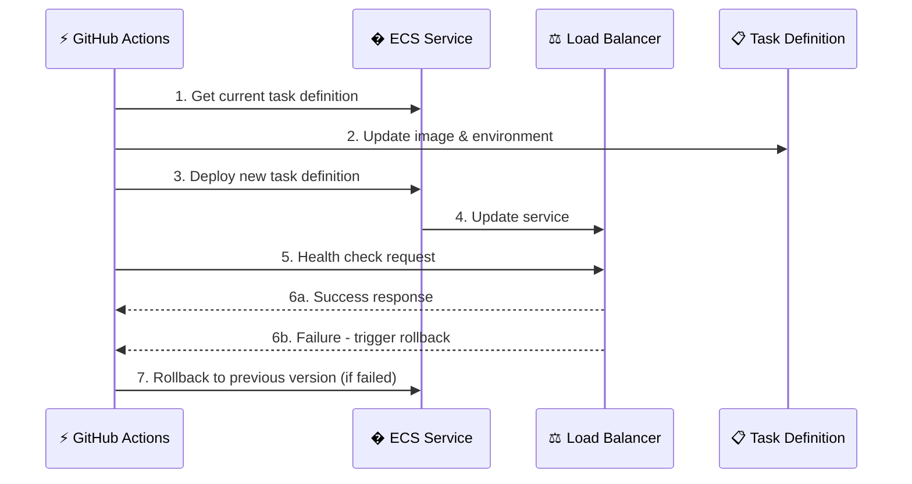

#### 🖥️ EC2 Deployment Flow

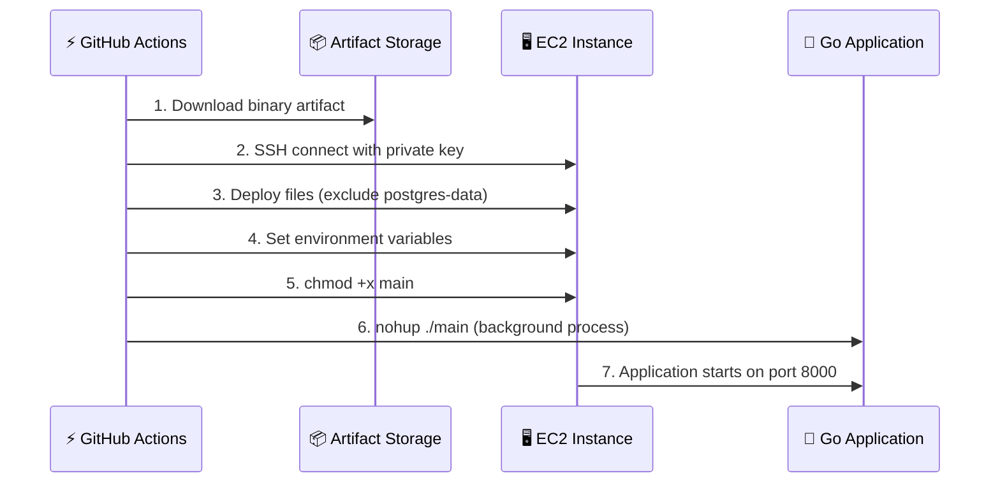

### 🧪 Load Testing Strategy

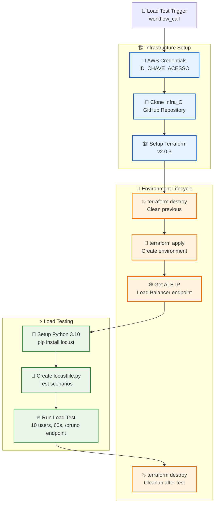

### 🔧 Runtime Configuration by Environment

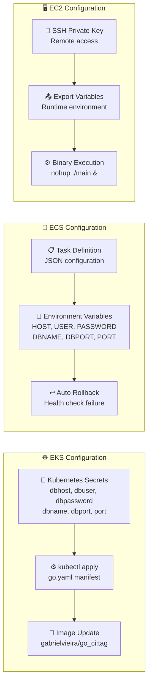

## 📈 Métricas e Monitoramento

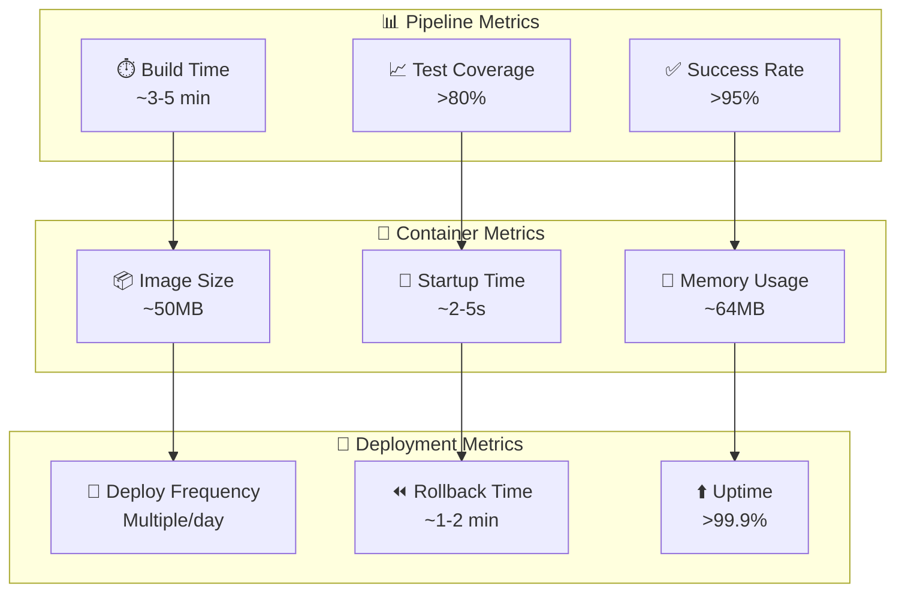

---

## 🚀 Como Usar Este Diagrama

1. **Para Novos Desenvolvedores**: Entender o fluxo completo
2. **Para DevOps**: Otimizar pipeline e infraestrutura
3. **Para Stakeholders**: Visualizar processo de entrega
4. **Para Troubleshooting**: Identificar pontos de falha

**💡 Dica**: Use este diagrama em apresentações e documentação técnica!
