# 🏗️ Arquitetura e Fluxo de Deploy

## 📊 Visão Geral da Infraestrutura

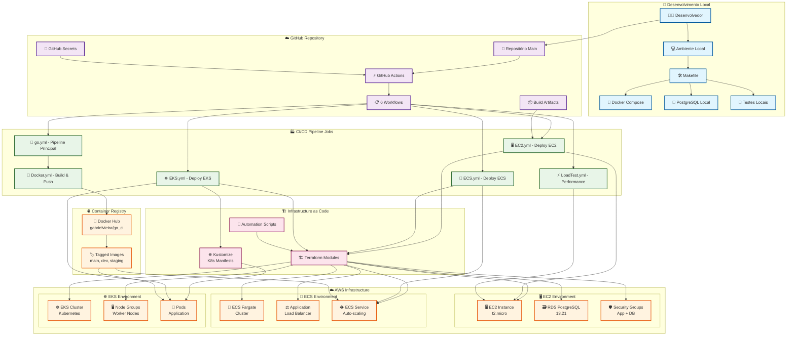
    WORKFLOW_GO --> BUILD
    WORKFLOW_GO --> LINT
    BUILD --> ARTIFACTS
    ARTIFACTS --> WORKFLOW_DOCKER
    WORKFLOW_DOCKER --> DOCKER_HUB

    %% Deploy
    DOCKER_HUB --> PROD_ENV
    PROD_ENV --> MONITORING

    %% Styling
    classDef devClass fill:#e1f5fe,stroke:#01579b,stroke-width:2px
    classDef githubClass fill:#f3e5f5,stroke:#4a148c,stroke-width:2px
    classDef cicdClass fill:#e8f5e8,stroke:#1b5e20,stroke-width:2px
    classDef deployClass fill:#fff3e0,stroke:#e65100,stroke-width:2px

    class DEV,LOCAL,MAKE,DOCKER_LOCAL,DB_LOCAL devClass
    class REPO,ACTIONS,SECRETS,ARTIFACTS githubClass
    class WORKFLOW_GO,WORKFLOW_DOCKER,TESTS,BUILD,LINT cicdClass
    class DOCKER_HUB,PROD_ENV,MONITORING deployClass
```

## 🔄 Fluxo Detalhado dos Workflows

### 🧪 Workflow Principal (go.yml)

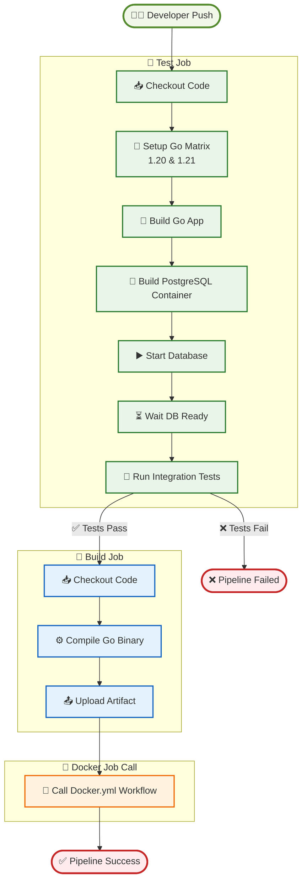

### � Workflows de Deploy

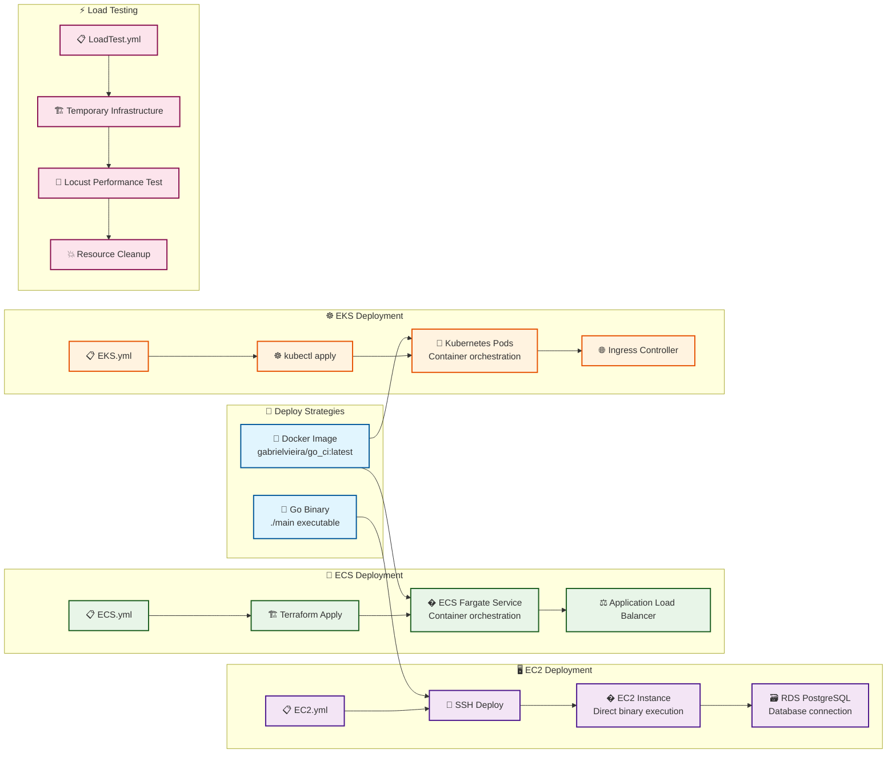
    COMPILE --> UPLOAD
    
    UPLOAD --> CHECKOUT3
    CHECKOUT3 --> DOWNLOAD
    DOWNLOAD --> DOCKER_LOGIN
    DOCKER_LOGIN --> DOCKER_BUILD
    DOCKER_BUILD --> DOCKER_PUSH
    DOCKER_PUSH --> DEPLOY_INFO
    DEPLOY_INFO --> SUCCESS

    %% Styling
    classDef testClass fill:#e8f5e8,stroke:#2e7d32,stroke-width:2px
    classDef buildClass fill:#e3f2fd,stroke:#1565c0,stroke-width:2px
    classDef dockerClass fill:#fff3e0,stroke:#ef6c00,stroke-width:2px
    classDef startClass fill:#f1f8e9,stroke:#558b2f,stroke-width:3px
    classDef endClass fill:#ffebee,stroke:#c62828,stroke-width:3px

    class CHECKOUT1,SETUP_GO,BUILD_APP,BUILD_DB,START_DB,WAIT_DB,RUN_TESTS testClass
    class CHECKOUT2,COMPILE,UPLOAD buildClass
    class CHECKOUT3,DOWNLOAD,DOCKER_LOGIN,DOCKER_BUILD,DOCKER_PUSH,DEPLOY_INFO dockerClass
    class START startClass
    class SUCCESS,FAIL endClass
```

## �️ Infraestrutura como Código

### 🏭 Terraform Modules Architecture

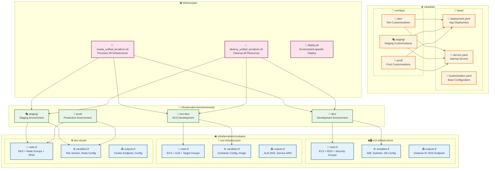

### 🐳 Container Environments

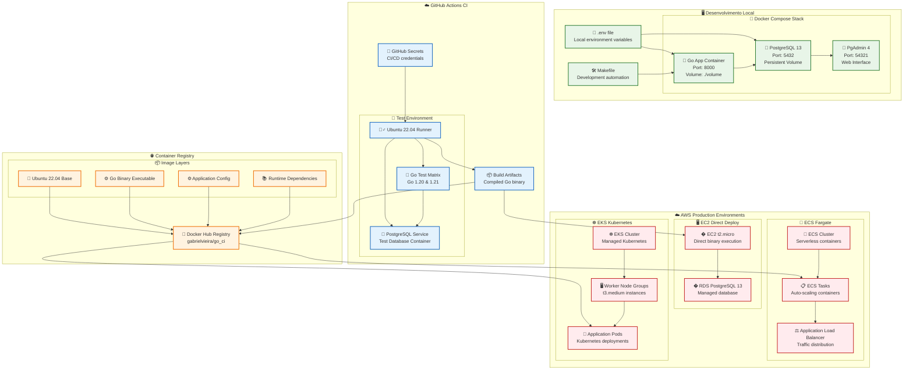
    APP_LOCAL --> DB_LOCAL
    DB_LOCAL --> PGADMIN_LOCAL

    %% Connections CI
    SECRETS_CI --> RUNNER
    RUNNER --> DB_CI
    RUNNER --> GO_TEST
    GO_TEST --> DB_CI

    %% Registry
    RUNNER --> DOCKER_HUB_REG
    UBUNTU --> DOCKER_HUB_REG
    GO_BINARY --> DOCKER_HUB_REG
    CONFIG --> DOCKER_HUB_REG

    %% Production
    DOCKER_HUB_REG --> PROD_CONTAINER
    PROD_CONTAINER --> PROD_DB
    LOAD_BALANCER --> PROD_CONTAINER

    %% Styling
    classDef localClass fill:#e8f5e8,stroke:#2e7d32,stroke-width:2px
    classDef ciClass fill:#e3f2fd,stroke:#1565c0,stroke-width:2px
    classDef registryClass fill:#fff3e0,stroke:#ef6c00,stroke-width:2px
    classDef prodClass fill:#ffebee,stroke:#c62828,stroke-width:2px

    class APP_LOCAL,DB_LOCAL,PGADMIN_LOCAL,ENV_LOCAL localClass
    class RUNNER,DB_CI,GO_TEST,SECRETS_CI ciClass
    class DOCKER_HUB_REG,UBUNTU,GO_BINARY,CONFIG registryClass
    class PROD_CONTAINER,PROD_DB,LOAD_BALANCER prodClass
```

## 🔐 Fluxo de Segurança e Secrets

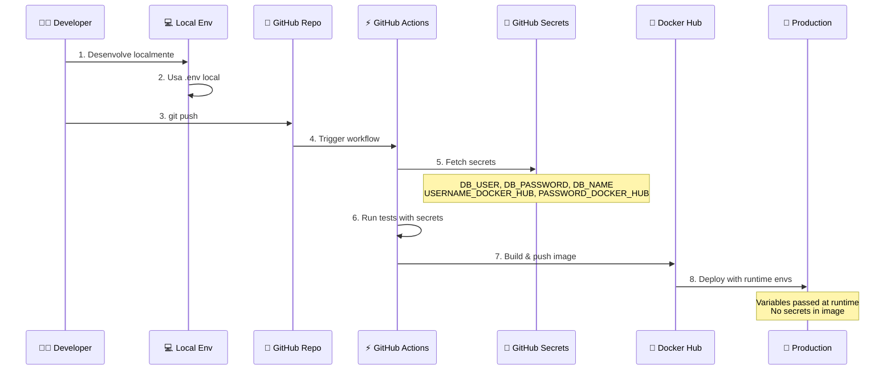

## 📊 Matriz de Ambientes

| Ambiente | Database | Secrets Source | Image Source | Monitoramento |
|----------|----------|----------------|--------------|---------------|
| 🖥️ **Local** | Docker Compose | `.env` file | Local build | Logs locais |
| 🧪 **CI/CD** | GitHub Actions | GitHub Secrets | Temporary build | GitHub Actions logs |
| 🚀 **Production** | External DB | Runtime vars | Docker Hub | APM/Logs externos |

## 🔄 Estratégias de Deploy

### 🚀 AWS Deployment Strategies

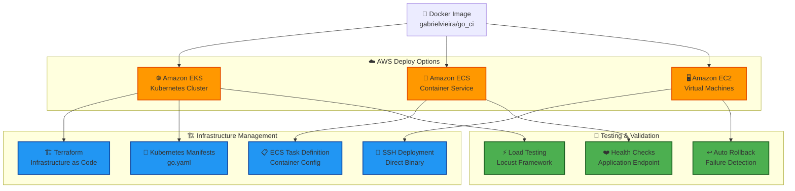

### 📊 Deployment Comparison Matrix

| Strategy | Infrastructure | Scaling | Complexity | Cost | Use Case |
|----------|----------------|---------|------------|------|----------|
| **☸️ EKS** | Kubernetes | Auto-scaling | High | High | Production microservices |
| **🐳 ECS** | Managed containers | Task-based | Medium | Medium | Containerized apps |
| **🖥️ EC2** | Virtual machines | Manual | Low | Low | Simple deployments |

### � Detailed Deploy Flows

#### ☸️ EKS Deployment Flow

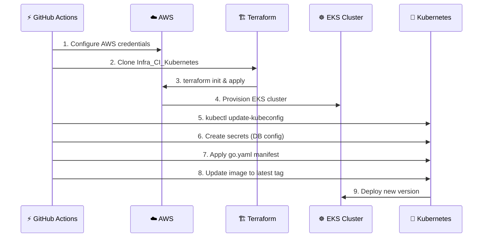

#### 🐳 ECS Deployment Flow

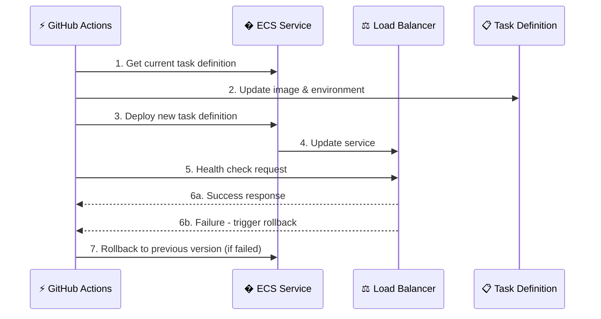

#### 🖥️ EC2 Deployment Flow

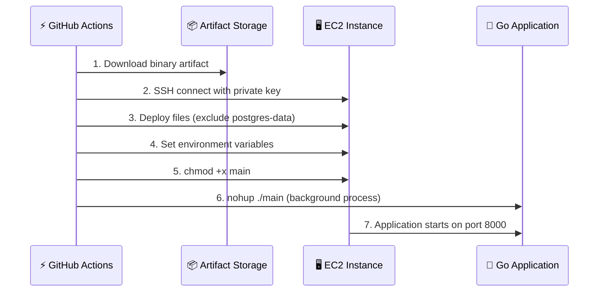

### 🧪 Load Testing Strategy

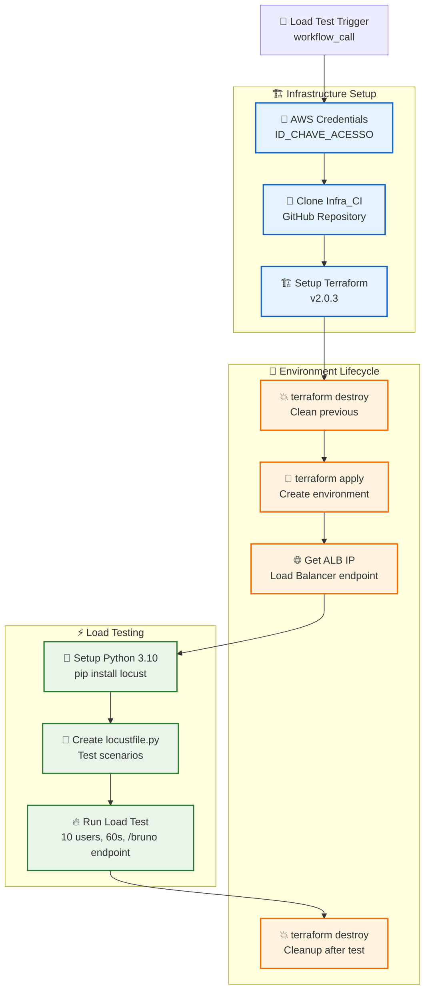

### 🔧 Runtime Configuration by Environment

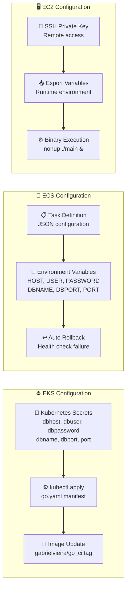

## 📈 Métricas e Monitoramento

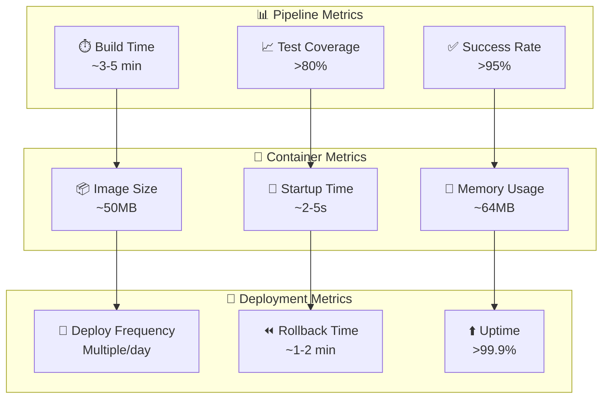

---

## 🚀 Como Usar Este Diagrama

1. **Para Novos Desenvolvedores**: Entender o fluxo completo
2. **Para DevOps**: Otimizar pipeline e infraestrutura
3. **Para Stakeholders**: Visualizar processo de entrega
4. **Para Troubleshooting**: Identificar pontos de falha

**💡 Dica**: Use este diagrama em apresentações e documentação técnica!
