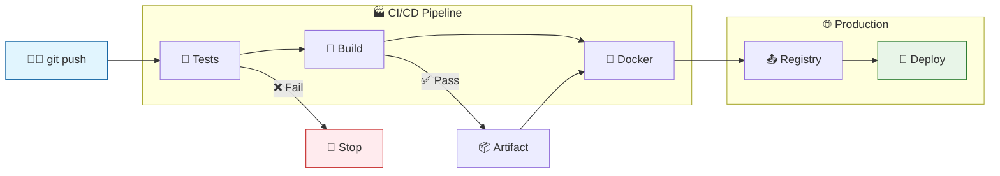

# 🚀 Integração Contínua com Docker e GitHub Actions

[](https://github.com/gabrielvieira1/integracao-continua-docker-github-actions/actions/workflows/go.yml)
[](https://github.com/gabrielvieira1/integracao-continua-docker-github-actions/actions/workflows/Docker.yml)

Um projeto completo demonstrando **Integração Contínua (CI/CD)** usando **GitHub Actions**, **Docker**, **PostgreSQL** e **Go (Gin)**. Este projeto implementa um pipeline automatizado com testes, build, containerização e deploy.

## 🏗️ Estrutura do Projeto

```
📦 integracao-continua-docker-github-actions/
├── � .github/workflows/          # GitHub Actions workflows
│   ├── 🧪 go.yml                 # Pipeline principal (test, build, docker)
│   ├── 🐳 Docker.yml             # Build e push da imagem Docker
│   ├── 🖥️ EC2.yml                # Deploy para Amazon EC2
│   ├── 🐳 ECS.yml                # Deploy para Amazon ECS
│   ├── ☸️ EKS.yml                # Deploy para Amazon EKS
│   └── ⚡ LoadTest.yml           # Testes de carga com Locust
├── 📁 infra/                     # Infraestrutura como código
│   ├── 📁 terraform/             # Configurações Terraform
│   │   ├── 📁 modules/           # Módulos reutilizáveis
│   │   │   ├── �️ ec2-infrastructure/
│   │   │   ├── 🐳 ecs-infrastructure/
│   │   │   └── ☸️ eks-cluster/
│   │   └── 📁 environments/      # Ambientes (dev, staging, prod)
│   │       ├── 🧪 dev/
│   │       ├── 🐳 ecs-dev/
│   │       ├── 🎭 staging/
│   │       └── 🚀 prod/
│   ├── � k8s/                   # Manifests Kubernetes
│   │   ├── 📁 base/              # Configurações base
│   │   └── 📁 overlays/          # Customizações por ambiente
│   ├── 📁 scripts/               # Scripts de automação
│   │   ├── � create_unified_terraform.sh
│   │   └── 💥 destroy_unified_terraform.sh
│   ├── 🚀 deploy.sh              # Script de deploy
│   └── 📖 README.md              # Documentação da infra
├── � controllers/               # Controladores da API
│   └── 🎮 controller.go
├── 📁 database/                  # Configuração do banco
│   └── 🗃️ db.go
├── 📁 models/                    # Modelos de dados
│   └── 👨‍🎓 alunos.go
├── � routes/                    # Definição de rotas
│   └── 🛣️ route.go
├── 📁 templates/                 # Templates HTML
│   ├── 🏠 index.html
│   └── ❌ 404.html
├── 📁 assets/                    # Arquivos estáticos
│   ├── 🎨 index.css
│   └── ❌ 404.css
├── � volume/                    # Volumes persistentes
│   ├── 💾 cache/
│   ├── 📚 lib/
│   ├── 📝 logs/
│   ├── 🔄 state/
│   └── ⏳ tmp/
├── 🐳 Dockerfile                 # Configuração do container
├── � docker-compose.yml         # Orquestração local
├── � Makefile                   # Automação de tarefas
├── 🗂️ go.mod                     # Dependências Go
├── �️ go.sum                     # Lock file das dependências
├── 🚀 main.go                    # Aplicação principal
├── 🧪 main_test.go               # Testes da aplicação
├── 📱 main                       # Binário compilado
├── ⚙️ .env.example               # Exemplo de variáveis de ambiente
├── 📋 .gitignore                 # Arquivos ignorados pelo Git
├── 📜 LICENSE                    # Licença do projeto
└── 📚 Documentação/
    ├── 📖 README.md              # Este arquivo
    ├── 🏗️ ARCHITECTURE.md        # Arquitetura detalhada
    ├── ☁️ AWS_DEPLOYMENT_GUIDE.md # Guia de deploy AWS
    ├── 🔐 DEPLOYMENT_STRATEGY.md  # Estratégias de deploy
    ├── 📊 DIAGRAMS.md             # Como visualizar diagramas
    └── 📋 EXECUTIVE_SUMMARY.md    # Resumo executivo
```

## 🔧 Stack Tecnológica

- **Backend**: Go (Gin Framework)
- **Banco de Dados**: PostgreSQL
- **ORM**: GORM
- **Containerização**: Docker & Docker Compose
- **CI/CD**: GitHub Actions
- **Testes**: Go testing + Testify
- **Linting**: golangci-lint
- **Registry**: Docker Hub
- **Infraestrutura**: Terraform (AWS EC2, RDS, Security Groups)
- **Deploy**: Automated deployment para EC2/ECS/EKS

## 🏢 Estratégias de Deploy

### 1. **EC2 Strategy (Terraform)**
- **Infraestrutura**: Terraform-managed
- **Recursos**: EC2 + RDS + Security Groups
- **Deploy**: SSH-based deployment
- **Ambiente**: Development/Staging

### 2. **ECS Strategy**
- **Infraestrutura**: Container orchestration
- **Recursos**: ECS Tasks + ALB + RDS
- **Deploy**: Docker container deployment
- **Ambiente**: Production-ready

### 3. **EKS Strategy (Kubernetes)**
- **Infraestrutura**: Kubernetes cluster
- **Recursos**: Pods + Services + Ingress
- **Deploy**: Kubernetes manifests
- **Ambiente**: High-availability production

## 🚀 Workflows Implementados

### 1. **Workflow Principal (`go.yml`)**

```yaml
Triggers: Push/PR em qualquer branch
┌─────────────────────────────────────┐
│ 🧪 JOB: TEST                       │
│ ├─ Setup Go (matrix: 1.21, 1.20)   │
│ ├─ Build aplicação Go              │
│ ├─ Build PostgreSQL container      │
│ ├─ Aguarda DB ficar pronto         │
│ └─ Executa testes integrados       │
├─────────────────────────────────────┤
│ 🔨 JOB: BUILD                      │
│ ├─ Compila aplicação               │
│ └─ Upload artifact para Docker job │
├─────────────────────────────────────┤
│ 🐳 JOB: DOCKER                     │
│ └─ Chama workflow Docker.yml       │
└─────────────────────────────────────┘
```

### 2. **Workflow Docker (`Docker.yml`)**

```yaml
Trigger: Workflow call do go.yml
┌─────────────────────────────────────┐
│ 🐳 JOB: DOCKER                     │
│ ├─ Download artifact (binário Go)   │
│ ├─ Login no Docker Hub             │
│ ├─ Build imagem Docker             │
│ ├─ Push para Docker Hub            │
│ └─ Mostra comandos de deploy       │
└─────────────────────────────────────┘
```

### 3. **Workflow EC2 (`EC2.yml`)**

```yaml
Trigger: Workflow call ou manual
┌─────────────────────────────────────┐
│ 🖥️ JOB: EC2-DEPLOY                 │
│ ├─ Configura credenciais AWS       │
│ ├─ Busca informações da EC2        │
│ ├─ Download do artifact Go         │
│ ├─ Deploy via SSH                  │
│ ├─ Configura variáveis ambiente    │
│ └─ Inicia aplicação na porta 8000  │
└─────────────────────────────────────┘
```

### 4. **Workflow ECS (`ECS.yml`)**

```yaml
Trigger: Workflow call ou manual
┌─────────────────────────────────────┐
│ 🐳 JOB: ECS-DEPLOY                 │
│ ├─ Configura credenciais AWS       │
│ ├─ Clona repositório infraestrutura│
│ ├─ Executa Terraform apply         │
│ ├─ Deploy container para ECS       │
│ ├─ Health check da aplicação       │
│ └─ Auto-rollback se necessário     │
└─────────────────────────────────────┘
```

### 5. **Workflow EKS (`EKS.yml`)**

```yaml
Trigger: Workflow call ou manual
┌─────────────────────────────────────┐
│ ☸️ JOB: EKS-DEPLOY                  │
│ ├─ Configura credenciais AWS       │
│ ├─ Clona repositório Kubernetes    │
│ ├─ Configura kubectl context       │
│ ├─ Aplica manifests K8s            │
│ ├─ Rolling update da aplicação     │
│ └─ Verifica pods em execução       │
└─────────────────────────────────────┘
```

### 6. **Workflow Load Test (`LoadTest.yml`)**

```yaml
Trigger: Schedule ou manual
┌─────────────────────────────────────┐
│ ⚡ JOB: LOAD-TEST                   │
│ ├─ Configura credenciais AWS       │
│ ├─ Destrói infraestrutura antiga   │
│ ├─ Cria infraestrutura temporária  │
│ ├─ Deploy da aplicação             │
│ ├─ Executa teste de carga (Locust) │
│ ├─ Coleta métricas de performance  │
│ └─ Limpa recursos temporários      │
└─────────────────────────────────────┘
```

## 🔄 Fluxo Visual do Pipeline



## 📋 Arquitetura Detalhada

> 📖 **Para diagramas completos da infraestrutura**: Veja [ARCHITECTURE.md](./ARCHITECTURE.md)

## 🧪 Como Testar os Workflows

### **Método 1: Testando via Git Push**
```bash
# Qualquer push irá triggar o workflow completo
git add .
git commit -m "feat: testando pipeline CI/CD"
git push origin main

# Acompanhe o progresso em:
# https://github.com/seu-usuario/seu-repo/actions
```

### **Método 2: Testando Pull Request**
```bash
# Crie uma nova branch
git checkout -b feature/teste-workflow

# Faça mudanças e push
git add .
git commit -m "test: validando PR workflow"
git push origin feature/teste-workflow

# Crie PR no GitHub - workflow será executado automaticamente
```

### **Método 3: Simulação Local com Makefile**
```bash
# Simula exatamente o pipeline do GitHub Actions
make ci

# Ou comandos individuais:
make lint          # Linting (como no CI)
make test          # Testes integrados
make build-docker  # Build Docker local
```

### **Método 4: Workflow Dispatch (Manual)**
No GitHub:
1. Vá em **Actions** → **Go** workflow
2. Clique **Run workflow** 
3. Selecione branch e execute

## 🏗️ Infraestrutura Terraform Unificada

### **Criação da Infraestrutura**

```bash
# Criar toda a infraestrutura automaticamente (EC2 + ECS)
./infra/scripts/create_unified_terraform.sh

# OU manualmente por ambiente
cd infra/terraform/environments/dev
terraform init
terraform plan
terraform apply
```

### **Recursos Criados por Módulo**

#### 🖥️ **Módulo EC2 Infrastructure**
- **EC2 Instance**: `api-go-dev-ec2-bastion` (t2.micro)
- **RDS Database**: `api-go-dev-rds-main` (PostgreSQL 13.21)
- **Security Groups**: App (8000, 22) + Database (5432)
- **Networking**: DB Subnet Group com VPC default

#### 🐳 **Módulo ECS Infrastructure**
- **ECS Cluster**: Fargate cluster para containers
- **ECS Service**: Auto-scaling service com health checks
- **Application Load Balancer**: Distribuição de tráfego
- **Target Groups**: Health checks na porta 8000
- **Task Definition**: Container specs e environment variables

#### ☸️ **Módulo EKS Cluster**
- **EKS Cluster**: Kubernetes cluster gerenciado
- **Node Groups**: Worker nodes para pods
- **Service Account**: IRSA para acesso AWS
- **Networking**: VPC e subnets otimizadas

### **Ambientes Disponíveis**
- **`dev/`**: Desenvolvimento com recursos mínimos
- **`ecs-dev/`**: Ambiente ECS para testes de container
- **`staging/`**: Ambiente de homologação
- ****`prod/`**: Ambiente de produção

### **Deploy Automatizado via GitHub Actions**

O workflow correspondente executa:

1. 🔍 Busca informações das instâncias AWS
2. 🔍 Busca detalhes de conexão do RDS  
3. 📦 Deploy do binário Go via SSH (EC2) ou container (ECS/EKS)
4. ⚙️ Configura variáveis de ambiente 
5. 🚀 Inicia aplicação na porta 8000
6. ❤️ Executa health checks e auto-rollback se necessário

### **Kubernetes Manifests (EKS)**

Estrutura Kustomize para diferentes ambientes:

```
📁 infra/k8s/
├── 📁 base/                   # Configurações base
│   ├── deployment.yaml       # Deployment da aplicação
│   ├── service.yaml          # Service interno
│   └── kustomization.yaml    # Base kustomization
└── 📁 overlays/              # Customizações por ambiente
    ├── 🧪 dev/               # Ambiente de desenvolvimento
    ├── 🎭 staging/           # Ambiente de staging  
    └── 🚀 prod/              # Ambiente de produção
```

### **Scripts de Automação**

```bash
# Criar infraestrutura unificada (todos os módulos)
./infra/scripts/create_unified_terraform.sh

# Destruir toda a infraestrutura
./infra/scripts/destroy_unified_terraform.sh

# Deploy específico (usado nos workflows)
./infra/deploy.sh [ec2|ecs|eks] [dev|staging|prod]
```

### **Configuração de Secrets por Ambiente**

Configure os seguintes secrets no GitHub:

```bash
# AWS Credentials (Repository Level)
AWS_ACCESS_KEY_ID_DEV         # Credencial AWS para dev
AWS_SECRET_ACCESS_KEY_DEV     # Credencial AWS para dev
AWS_ACCESS_KEY_ID_PROD        # Credencial AWS para prod
AWS_SECRET_ACCESS_KEY_PROD    # Credencial AWS para prod

# Database Configuration (Environment Level)
DB_PASSWORD_DEV=123456789     # Senha do banco dev
DB_PASSWORD_PROD=secure_pass  # Senha do banco prod

# SSH Keys (para deploy EC2)
SSH_PRIVATE_KEY               # Chave SSH para EC2
REMOTE_USER                   # Usuário SSH (ex: ec2-user)

# Docker Registry
USERNAME_DOCKER_HUB           # Docker Hub username
PASSWORD_DOCKER_HUB           # Docker Hub password
```

### **Destruir Infraestrutura**

```bash
# Remover toda a infraestrutura
./infra/scripts/destroy_unified_terraform.sh
```

## 📊 Monitoramento e Debug

### **Visualizando Logs dos Workflows**
```bash
# No GitHub Actions, cada job mostra:
🧪 Testes: Resultados detalhados dos testes Go
🔍 Linting: Problemas de código encontrados  
🔨 Build: Compilação e artifacts gerados
🐳 Docker: Build e push para registry
```

### **Debugando Falhas Localmente**
```bash
# Se workflow falhar, replique localmente:
make validate-env  # Verifica configuração
make show-env      # Mostra variáveis (sem senhas)
make ci            # Executa pipeline completo
make logs          # Logs dos containers
```

### **Status dos Workflows**
- ✅ **Success**: Pipeline completo executado
- ❌ **Failed**: Erro em algum step (ver logs)
- 🟡 **In Progress**: Workflow executando
- ⏸️ **Skipped**: Conditions não atendidas

## 🎯 Cenários de Teste dos Workflows

### **🧪 Cenário 1: Teste de Integração Completa**
```bash
# Simula uma feature completa
git checkout -b feature/nova-funcionalidade
# Modifique código da aplicação
make ci  # Testa localmente primeiro
git push origin feature/nova-funcionalidade
# Crie PR e observe pipeline completo
```

### **🔨 Cenário 2: Teste de Build e Deploy**
```bash
# Testa apenas build e containerização
git checkout main
git tag v1.0.0  # Cria tag para versioning
git push origin v1.0.0
# Workflow irá buildar com tag específica
```

### **🐳 Cenário 3: Teste de Docker Registry**
```bash
# Verifica se imagem foi publicada corretamente
docker pull seu-username/go_ci:main
docker run -p 8000:8000 seu-username/go_ci:main
```

### **⚡ Cenário 4: Teste de Rollback**
```bash
# Simula falha e correção
echo "código com erro" >> main.go
git commit -am "fix: corrigindo erro"
git push origin main
# Workflow falhará, corrija e push novamente
```

## 🔍 Troubleshooting Específico para CI/CD

### **Workflow não executa**
- ✅ Verifique se arquivo `.yml` está em `.github/workflows/`
- ✅ Confirme sintaxe YAML válida
- ✅ Check se branch/event triggers estão corretos

### **Docker build falha**
- ✅ Verifique se artifact foi gerado no job anterior
- ✅ Confirme que Dockerfile pode acessar `./main`
- ✅ Teste build localmente: `make build-docker`

### **Push para Docker Hub falha**
- ✅ Repositório existe no Docker Hub?
- ✅ Secrets `USERNAME_DOCKER_HUB` e `PASSWORD_DOCKER_HUB` corretos?
- ✅ Token tem permissões de write?

### **Testes falham no CI mas passam localmente**
- ✅ Variáveis de ambiente diferentes
- ✅ PostgreSQL versão/configuração
- ✅ Dependências/versões Go diferentes

## 📈 Melhorias Futuras

- [ ] **Cache de dependências Go** para builds mais rápidos
- [ ] **Testes de segurança** com ferramentas como Snyk
- [ ] **Deploy automático** para staging/production
- [ ] **Notificações** Slack/Discord para builds
- [ ] **Matriz de testes** com diferentes versões PostgreSQL
- [ ] **Análise de cobertura** de código
- [ ] **Testes de performance** automatizados

## 🏆 Resultado Final dos Workflows

### **✅ Pipeline de Sucesso Produz:**
1. **🧪 Relatório de Testes**: Todos os testes Go passando
2. **🔍 Relatório de Linting**: Código seguindo padrões
3. **📦 Artifact**: Binário Go compilado
4. **🐳 Imagem Docker**: Publicada no Docker Hub
5. **📋 Comandos Deploy**: Prontos para produção

### **🔗 Links Úteis após Deploy:**
```bash
# Imagem Docker disponível em:
https://hub.docker.com/r/seu-username/go_ci

# Executar em qualquer ambiente:
docker run -e DB_USER=user -e DB_PASSWORD=pass -e DB_NAME=db \
  -p 8000:8000 seu-username/go_ci:latest

# API estará disponível em:
http://localhost:8000
```

### **📊 Métricas de Sucesso:**
- ⏱️ **Tempo de Build**: ~3-5 minutos
- 🧪 **Coverage**: >80% (configurável)
- 🐳 **Imagem Size**: <50MB (otimizada)
- 🔄 **Frequency**: A cada push/PR

---

**🎉 Parabéns! Você agora tem um pipeline CI/CD completo e funcional!**

Para mais detalhes sobre comandos locais, consulte as seções do Makefile abaixo.

## Configuração de GitHub Secrets

⚠️ **IMPORTANTE PARA SEGURANÇA**: Este projeto foi configurado para NÃO ter credenciais hardcoded no código. Todas as variáveis sensíveis devem ser configuradas via GitHub Secrets.

## Como configurar os Secrets

1. Vá para o seu repositório no GitHub
2. Clique em **Settings** → **Secrets and variables** → **Actions**
3. Clique em **New repository secret**
4. Adicione os seguintes secrets:

### Secrets para Docker Hub

- `USERNAME_DOCKER_HUB`: Seu username do Docker Hub
- `PASSWORD_DOCKER_HUB`: Seu password ou token do Docker Hub

### Secrets para Banco de Dados

- `DB_USER`: Usuário do banco de dados PostgreSQL
- `DB_PASSWORD`: Senha do banco de dados PostgreSQL
- `DB_NAME`: Nome do banco de dados PostgreSQL

## Environment (Opcional)

Para usar environments no GitHub Actions, vá em **Settings** → **Environments** e crie um environment chamado `production`.

## Como executar localmente

⚠️ **IMPORTANTE**: As variáveis de ambiente são **obrigatórias**. Sem elas, o docker-compose falhará.

### Opção 1: Arquivo .env (Recomendado para desenvolvimento local apenas)
1. Copie o arquivo `.env.example` para `.env`:
   ```bash
   cp .env.example .env
   ```

2. **Edite o arquivo `.env` com suas credenciais reais**:
   ```bash
   # Exemplo - substitua pelos seus valores
   DB_USER=meu_usuario_real
   DB_PASSWORD=minha_senha_real
   DB_NAME=meu_banco_real
   ```

3. Execute com docker-compose:
   ```bash
   docker-compose up -d
   ```

### Opção 2: Variáveis de ambiente diretas
```bash
DB_USER=seu_usuario DB_PASSWORD=sua_senha DB_NAME=seu_banco docker-compose up -d
```

## Como executar a imagem de produção

```bash
docker run -e HOST=localhost -e PORT=5432 -e DB_USER=seu_usuario -e DB_PASSWORD=sua_senha -e DB_NAME=seu_banco -p 8000:8000 bielvieira/go_ci:30
```

## Segurança

✅ **O que está seguro:**

- Todas as credenciais usam GitHub Secrets
- Arquivo `.env` está no `.gitignore`
- Dockerfile não contém informações sensíveis
- Workflows do GitHub Actions usam secrets para credenciais
- **Sem valores padrão sensíveis**: docker-compose falha se as variáveis não estiverem definidas

❌ **NUNCA faça:**

- Commite arquivos `.env` com credenciais reais
- Use credenciais hardcoded nos workflows
- Exponha senhas em logs ou documentação
- **Use credenciais reais como valores padrão (fallback)**

⚠️ **IMPORTANTE**: Este projeto foi configurado para **falhar** se as variáveis de ambiente não estiverem definidas, impedindo o uso acidental de credenciais padrão inseguras.


# 🚀 Guia do Makefile

Este Makefile fornece comandos para testar e executar o projeto localmente, simulando o ambiente de CI/CD.

## 📋 Setup Inicial

```bash
# Configuração inicial (cria .env se não existir)
make setup

# Verificar se .env existe
make check-env

# Ver todos os comandos disponíveis
make help
```

## 🧪 Testando o Projeto

### Teste Completo (Simula GitHub Actions)
```bash
# Simula exatamente o que acontece no CI
make ci
```

Este comando executa:
1. ✅ Limpa ambiente anterior
2. 🐘 Inicia PostgreSQL
3. ⏳ Aguarda banco ficar pronto
4. 🔍 Executa linting
5. 🔨 Compila aplicação
6. 🧪 Executa testes

### Testes Individuais
```bash
# Apenas testes
make test

# Testes no container
make test-container

# Apenas linting
make lint

# Apenas build
make build
```

## 🐳 Gerenciamento Docker

```bash
# Iniciar todos os serviços
make start

# Iniciar apenas PostgreSQL
make start-db

# Parar serviços
make stop

# Ver status
make status

# Ver logs
make logs
```

## 🧹 Limpeza

```bash
# Limpar dados do PostgreSQL
make clean-db

# Limpar tudo (containers, volumes, imagens)
make clean
```

## 🔧 Troubleshooting

### Erro: "Arquivo .env não encontrado"
```bash
make setup
# Depois edite o .env com suas credenciais
```

### PostgreSQL não conecta
```bash
# Verificar se está rodando
make status

# Ver logs
make logs

# Reiniciar
make stop && make start-db
```

### Testes falhando
```bash
# Verificar se banco está pronto
make wait-db

# Executar apenas os testes
make test
```

## 🎯 Comandos Principais para Desenvolvimento

```bash
# Setup inicial
make setup

# Desenvolvimento diário
make ci  # Executa pipeline completo

# Debug
make logs  # Ver logs dos serviços
```

## 📖 Documentação Completa

- **📋 [Resumo Executivo](EXECUTIVE_SUMMARY.md)** - Visão geral do projeto e benefícios
- **🏗️ [Documentação de Arquitetura](ARCHITECTURE.md)** - Diagramas e fluxos detalhados
- **☁️ [Guia de Deploy AWS](AWS_DEPLOYMENT_GUIDE.md)** - Estratégias EKS, ECS, EC2 e Load Testing
- **🧪 [Guia de Testes Locais](LOCAL_TESTING_GUIDE.md)** - Como testar as estratégias localmente
- **📊 [Guia de Visualizações](DIAGRAMS.md)** - Como visualizar os diagramas Mermaid

## 🤔 How to contribute

- Make a fork;
- Clone the forked repository;
- Create a branch with your feature: `git checkout -b my-feature`;
- Commit changes: `git commit -m 'feat: My new feature'`;
- Make a push to your branch: `git push -u origin my-feature`;
- Create a PR from your branch to my branch.

After merging your receipt request to done, you can delete a branch from yours.

## :memo: License

This project is under the MIT license. See the [LICENSE](LICENSE) for details.

Made with ♥ by Gabriel Vieira :wave: [Get in touch!](https://www.linkedin.com/in/bielvieira/)`
